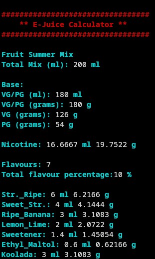

# vapecalc-cli
## Calculate your e-juice by weight and volume


#### *improvements and suggestions welcome*  
Script inspired by others seen online, but namely by [EjuiceCalculator](https://github.com/lwturkjr/EjuiceCalculator) and [vaper.ninja's](https://tools.vaper.ninja/) online calculator.
And as me and python do not work well together, I decided to make my own bash script, seeing also that nobody had yet made a proper calculator with support for weight for linux.  
## Installation
Simply clone or download the script to the directory of your choice and make it executable.  
The script is now also available on the aur!  
To install, simply ```yay -S vapecalc-cli``` or (``paru -S`` if you use paru).  
## Configuration
There are certain values that can be changed, such as default VG and PG weight values, display colors, temporary directory and saved recipes directory.  
Some defaults are already added for conveninence.  
All that's needed is to uncomment the ones you want to use.  
*All of the values are taken from [vaper.ninja's](https://tools.vaper.ninja/) website.*  
<br clear="right"/>
- Added weight value defaults (uncomment the ones you'd like to use):
```bash
## Default
vg="1.249"
pg="1.0361"

## Amazon Essentials
#vg="1.2881"
#pg="1.07887"

## botboy41 (https://www.reddit.com/r/DIY_eJuice/comments/2iq3km/botboy141_guide_to_mixing_by_weight/)
#vg="1.26"
#pg="1.038"

## v-ecigs.com (http://www.v-ecigs.com/tfa-flavor-percentage-recommendations/)
#vg="1.261"
#pg="1.036"
```
- Default saved recipes directory:
```bash
recipe="$HOME/Documents/Recipes/vape_recipes.txt"
```
- Default temporary directory:
```bash
tmp="/tmp/vapecalc"
tmp2="/tmp/vapecalc_flavours"
```
- Displayed text color options (from [linuxhandbook](https://linuxhandbook.com/change-echo-output-color/)):
```bash
## Black
b="\033[00;30m"

## Dark gray
lb="\033[01;30m"

## Light Gray
ly="\033[00;37m"

## Red
r="\033[00;31m"

## Light Red
lr="\033[01;31m"

## Green
g="\033[00;32m"

## Light Green
lg="\033[01;32m"

## Brown/Orange
o="\033[00;33m"

## Yellow
lo="\033[01;33m"

## Blue
u="\033[00;34m"

## Light blue
lu="\033[01;34m"

## Purple
p="\033[00;35m"

## Light Purple
lp="\033[01;35m"

## Cyan
c="\033[00;36m"

## Light Cyan
lc="\033[01;36m"

## White
w="\033[01;37m"

## End
e="\033[0m"

## FIXED COLOR OPTIONS

## Sed beginning
so="\x1b[1;36m"

## Sed end
se="\x1b[0m"

## License start
ls="\e[4;32m\e]8;;"

## Author start
as="\e[4;35m\e]8;;"

## Link end
le="\e]8;;\a\033[0m"
```
For the color options, you will need to search and replace all color values to one of the above listed values,  
e.g. ``${lr}`` (light red) to ``${lg}`` (light green), etc...  
For The ones under "FIXED COLOR OPTIONS" you simply need to change the value itself.
You can use the colors above as reference, e.g.:
```bash
From 
## Sed beginning (default is Light Cyan)
so="\x1b[1;36m"
to 
so="\x1b[1;32m" (Light Green)
```
---
## Usage
By default if no arguements are passed it will start in calculator mode.
```bash
vapecalc [option]

Options:

c    -> Calculate and/or save recipes

l    -> Load recipe

r    -> Remove a saved recipe

h    -> Print this help message
```
## Donate
BTC: bc1qn8z2jcm0nxgwsssr5leu7gs9hrltuxt94xsmj5  
LTC: ltc1qghje97y75lr3wqc5u3qc80ag9sg04sy9453d62  
XMR: 83DP8YWimcZBsGkgdegsvRdARa94LoYXeeBjFbbdrQNzMcBw9N7kpyZbydL9iGA9Sc8G1dx42A1bHPvQsmTo5UVj7buwVEm
